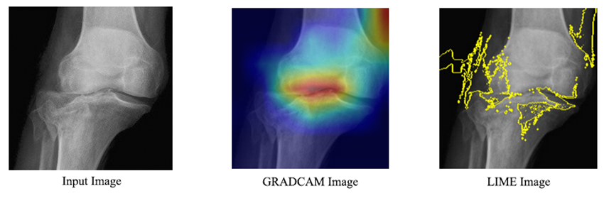

# Bone Fracture Detection using Deep Learning and Explainable AI

## Overview
This project presents a deep learning-based system for automated bone fracture detection and classification from X-ray images using advanced CNN architectures such as ResNet50, DenseNet121, EfficientNet, and VGG. The system integrates Explainable AI (XAI) techniques including Grad-CAM and LIME to improve transparency, reliability, and clinical trust in fracture detection.

The project also includes fracture severity estimation and treatment recommendation modules to support healthcare professionals in clinical decision-making.

---

## Features
- Bone fracture detection and classification from X-ray images
- Multiple CNN architectures:
  - ResNet50
  - DenseNet121
  - EfficientNet
  - VGG
- Explainable AI using:
  - Grad-CAM
  - LIME
- Fracture severity estimation
- Treatment recommendation support
- Image preprocessing and augmentation
- Performance evaluation and visualization

---

## Technologies Used
- Python
- TensorFlow / Keras
- OpenCV
- NumPy
- Pandas
- Matplotlib
- Seaborn
- Scikit-learn
- Grad-CAM
- LIME

---

## Project Structure

```bash
bone-fracture-detection/
│
├── dataset/
├── models/
├── notebooks/
├── outputs/
├── screenshots/
├── train.py
├── predict.py
├── xai.py
├── requirements.txt
└── README.md
```

---
## Dataset

This dataset is a curated collection of medical images of human bone fractures, categorized into 17 distinct fracture types. It has been compiled to support research in medical image classification, deep learning and clinical decision support systems. Fracture classification is an important aspect of orthopedic diagnostics, as different fracture types require different treatment approaches. By providing a diverse, well-labeled dataset, this collection can be used to train and benchmark machine learning models for automatic fracture detection and classification.

The dataset contains 17 classes of bone fractures:
1. Avulsion fracture
2. Closed (simple) fracture
3. Comminuted fracture
4. Compression (crush) fracture
5. Fracture dislocation
6. Greenstick fracture
7. Hairline fracture
8. Impacted fracture
9. Intra-articular fracture
10. Longitudinal fracture
11. Oblique fracture
12. Open (compound) fracture
13. Pathological fracture
14. Segmental fracture
15. Spiral fracture
16. Stress fracture
17. Transverse fracture

Image Type: X-ray, radiology
Format: JPG / PNG / WEBP
Organization: Each fracture type is stored in its own folder
Intended Use: Research, medical AI development, and educational purposes

- Human Bone Fracture C17 Dataset: https://data.mendeley.com/datasets/2j8vvz3j6v/1?utm


Example dataset structure:

```bash
dataset/
│
├── train/
│   ├── fractured/
│   └── normal/
│
├── test/
│   ├── fractured/
│   └── normal/
```

---

## Installation

Clone the repository:

```bash
git clone https://github.com/your-username/bone-fracture-detection.git
cd bone-fracture-detection
```

Install dependencies:

```bash
pip install -r requirements.txt
```

---

## Usage

Train the model:

```bash
python train.py
```

Run prediction:

```bash
python predict.py --image sample.jpg
```

Generate Explainable AI visualizations:

```bash
python xai.py
```

---

## Workflow
1. Data Collection
2. Image Preprocessing
3. CNN Model Training
4. Fracture Detection & Classification
5. Explainability using Grad-CAM & LIME
6. Severity Estimation
7. Treatment Recommendation

---

## Result Screenshots

### Grad-CAM Visualization | LIME Explanation


---

## Future Scope
- Real-time fracture detection
- Multi-class fracture localization
- Web and mobile deployment
- Integration with hospital systems

---

## Contributors
- Anshul Sharma

---

## License
This project is developed for academic and research purposes.
